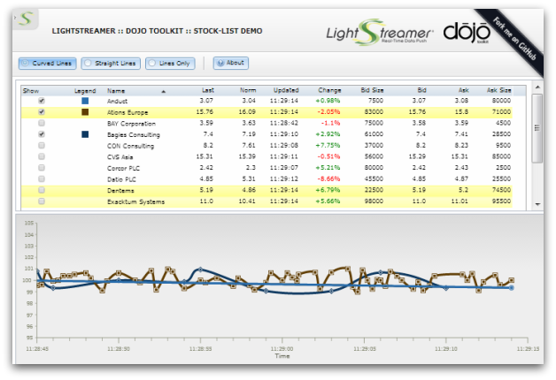

# Lightstreamer - Stock-List Demo - HTML (Dojo Toolkit) Client

<!-- START DESCRIPTION lightstreamer-example-stocklist-client-dojo -->

A simple stocklist demo application showing integration between the <b>Dojo Toolkit</b> and the <b>Lightstreamer JavaScript Client library</b>.

## Live Demo

[](http://demos.lightstreamer.com/DojoDemo/)<br>
###[ View live demo](http://demos.lightstreamer.com/DojoDemo/)<br>

## Details

The demo shows how to use the Lightstreamer JavaScript Client library, the [lightstreamer-store](https://github.com/Weswit/dojo-lightstreamer-store), the [dgrid](https://github.com/SitePen/dgrid) component and [DojoX Charts](https://github.com/dojo/dojox) together.<br>

Real-Time simulated Stock-List data is received from the Lightstreamer Server deployed @ [http://push.lightstreamer.com](http://push.lightstreamer.com)<br>

<!-- END DESCRIPTION lightstreamer-example-stocklist-client-dojo -->

## Install

If you want to install a version of this demo pointing to your local Lightstreamer Server, follow these steps:

* Note that, as prerequisite, the [Lightstreamer - Stock- List Demo - Java Adapter](https://github.com/Weswit/Lightstreamer-example-Stocklist-adapter-java) has to be deployed on your local Lightstreamer Server instance. Please check out that project and follow the installation instructions provided with it.
* Launch Lightstreamer Server.
* Crate the folders `/pages/demos/[demo_name]` into your Lightstreamer server installation then copy here the content of `src` folder of this project.
* Get the `lightstreamer_namespace.js` file from the [latest Lightstreamer distribution](http://www.lightstreamer.com/download) and put it in the `src` folder of the demo. Alternatively you can build a `lightstreamer_namespace.js` file from the [online generator](http://www.lightstreamer.com/distros/Lightstreamer_Allegro-Presto-Vivace_5_1_1_Colosseo_20140310/Lightstreamer/DOCS-SDKs/sdk_client_javascript/tools/generator.html).
In that case be sure to include the LightstreamerClient, Subscription and StatusWidget modules and to use the "AMD with namespaced names" version.
*  Download [the Dojo Toolkit](http://download.dojotoolkit.org) and copy the `dojox` folder from the package to the `src` folder of the demo. The demo requires the Dojo Toolkit v.1.8 or higher.
*  Using the [CommonJS Package Manager](https://github.com/kriszyp/cpm) install dgrid, dijit and lightstreamer-store in the `src` folder; dependencies for these packages will be automatically resolved by the cpm process:
  - cpm install dgrid 0.3.8
  - cpm install dijit
  - cpm install lightstreamer-store
* The demo is now ready to be launched: navigate to `src/index.html` and enjoy.

## Build

It is suggested to compress the dojo/dojox/dijit files in a single js source file to minimize startup times.

Head for the [Dojo Web Builder](http://build.dojotoolkit.org/) and select the following packages:

-  dijit.layout.BorderContainer
-  dijit.Dialog
-  dijit.registry
-  dojox.charting.Chart
-  dojox.charting.StoreSeries
-  dojox.charting.axis2d.Default
-  dojox.charting.plot2d.Default
-  dojox.charting.themes.Claro
-  dijit.form.ToggleButton
-  dojo.store.Memory
-  dojo.store.Observable
-  dojo.parser
-  dojo.domReady
-  dijit.layout.ContentPane
-  dijit.form.Button
-  dojox.collections.Dictionary
-  dojox.collections.ArrayList
-  dojox.gfx.svg

Then click the "build" button and wait. Once the builder is done a zip file will be dowloaded; copy the files/folders from the archive in the `src/dojo` foloder and reload the demo. <br>

Once the demo is working in your environment it is time to deploy it on a web server. 

The demo currently connects to a local Lightstreamer server to get the stock data. It is possible to change this setting making the demo point to a different server. Obviously in this 
case the DEMO adapter needs to be installed on the tagert server (currently such adapter is installed by default).
To change the server edit the `js/lsClient.js` file and substitute the following line:

```js
    var lsClient = new LightstreamerClient(protocolToUse+"//localhost:"+portToUse,"DEMO");
```

with:

```js
    var lsClient = new LightstreamerClient(myServer,"DEMO");
```

where myServer contains the address of the server (comprehending the port if different from the default one).
As an example, to connect to a local server listening on port 8080 use:

```js
    var lsClient = new LightstreamerClient("http://localhost:8080","DEMO");
```    

## See Also

### Lightstreamer Adapters Needed by This Client

<!-- START RELATED_ENTRIES -->
* [Lightstreamer - Stock-List Demo - Java Adapter](https://github.com/Weswit/Lightstreamer-example-Stocklist-adapter-java)
* [Lightstreamer - Reusable Metadata Adapters- Java Adapter](https://github.com/Weswit/Lightstreamer-example-ReusableMetadata-adapter-java)

<!-- END RELATED_ENTRIES -->
### Related Projects

* [Lightstreamer - Stock-List Demos - HTML Clients](https://github.com/Weswit/Lightstreamer-example-Stocklist-client-javascript)
* [Lightstreamer - Basic Stock-List Demo - jQuery (jqGrid) Client](https://github.com/Weswit/Lightstreamer-example-StockList-client-jquery)
* [Lightstreamer - Basic Stock-List Demo - Java SE (Swing) Client](https://github.com/Weswit/Lightstreamer-example-StockList-client-java)
* [Lightstreamer - Basic Stock-List Demo - .NET Client](https://github.com/Weswit/Lightstreamer-example-StockList-client-dotnet)
* [LightstreamerStore for Dojo](https://github.com/Weswit/dojo-lightstreamer-store)

## Lightstreamer Compatibility Notes #

* Compatible with Lightstreamer JavaScript Client library version 6.0 or newer.
* Compatible with Dojo Toolkit v.1.8 or newer.
